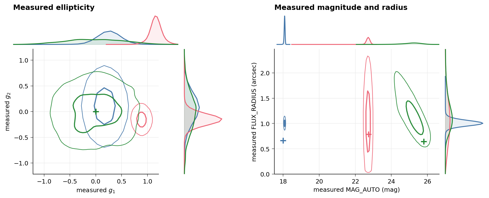

# Simulation-Based Shear Inference (SBSI)

SBSI is an integrated weak gravitational lensing (shear) calibration framework, accounting for detection and selection bias,
as well as blending.

SBSI provides one model-name-agnostic workflow with three API areas:

1. `sbsi.flow` — train and tune a conditional measurement flow.
2. `sbsi.response` — combine flow self-response and emulator blending response.
3. `sbsi.inference` — simulation-based shear inference (under development).

The [inference tutorial notebook](examples/sbsi_api_tutorial.ipynb) is the main
user-facing prediction walkthrough. Training and tuning use the CLI described
below.

## Conditional measurement predictions

The measurement flow returns joint predictive distributions, not only point
estimates. This example shows measured ellipticity, magnitude, and linear
FLUX_RADIUS for representative bright, middle, and faint galaxies. The curves
are the one- and two-sigma highest-density contours; plus signs mark the input
galaxy parameters. The complete example is reproducible from the tutorial
notebook.



## Image simulation and measurement

SBSI training data are generated using BlendEMU. 
BlendEMU owns rendering, measurement, and simulation-catalogue construction.
SBSI calls its supported pipeline CLI. The
[example Slurm wrapper](examples/job_blendemu.sh) runs BlendEMU steps
1 through 4b from a user-owned YAML configuration. 

## Training and tuning

Flow training is config-driven, like BlendEMU. Copy
[`examples/flow_training.yaml`](examples/flow_training.yaml), replace every
catalogue and artifact path, and run inside an appropriate compute allocation:

```bash
python -m sbsi flow --config my_flow.yaml --mode train
python -m sbsi flow --config my_flow.yaml --mode tune
```

An editable/package install provides the equivalent `sbsi` command.

`--mode train` produces the configured checkpoint and averaged `*_swaavg.pt`
checkpoint. `--mode tune` trains the explicit candidate list, evaluates each
checkpoint with the user-supplied `package.module:function` scorer on the
separate validation catalogue, and writes a ranked JSON manifest. Existing
artifacts are never overwritten. Scheduler wrappers are deployment details and
are not part of SBSI.

$R_{\rm blend}$ Emulator training and tuning remain in BlendEMU.

## Environment

Use one Python environment for the SBSI checkout and its BlendEMU dependency. Install
both repositories editable; do not add checkout paths to `PYTHONPATH`, and do not rely
on launching Python from a particular directory:

```bash
conda activate sims1
python -m pip install --config-settings editable_mode=compat -e /path/to/blendemu
python -m pip install -e /path/to/SBSI
```

For simultaneous git worktrees, give each worktree a small environment overlay so one
editable `sbsi` installation cannot silently select another checkout:

```bash
cd /path/to/SBSI-worktree
/path/to/sims1/bin/python -m venv --system-site-packages .venv
# This cluster's venv seed is older than the Setuptools inherited from sims1.
.venv/bin/python -m pip uninstall -y setuptools
.venv/bin/python -m pip install --no-build-isolation --no-deps \
    --config-settings editable_mode=compat -e /path/to/blendemu
.venv/bin/python -m pip install --no-build-isolation --no-deps -e .
.venv/bin/python -m ipykernel install --user \
    --name sbsi-master --display-name "SBSI master"
```

Select that kernel in `examples/sbsi_api_tutorial.ipynb`. The notebook obtains bundled
data through `sbsi.example_path`, and model presets resolve from the imported checkout's
`models/` directory, so the Jupyter server's working directory is irrelevant. Use
`SBSI_CACHE_DIR` or `BLENDEMU_MODELS` only to override model artifacts stored elsewhere.

To confirm which code a process is using:

```bash
python -c 'import sbsi, blendemu; print(sbsi.__file__); print(blendemu.__file__)'
```

BlendEMU is only required for emulator prediction; the flow checkpoints need SBSI and
PyTorch alone.
